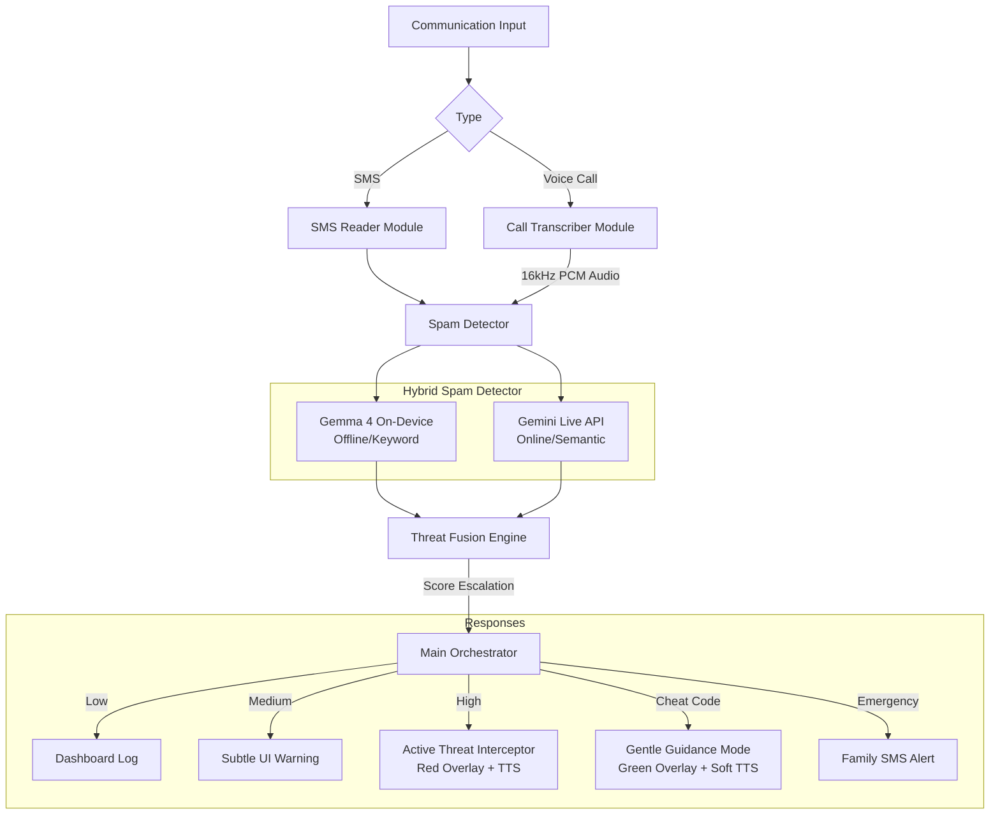

# Rakshak: Digital Arrest Extortion Interceptor - Overview

Rakshak is a hybrid AI-powered Android application designed to protect elderly citizens in India from "Digital Arrest" and extortion scams. It monitors communication channels in real-time, using a combination of on-device and cloud-based AI to detect threats and intervene with a protective "Vigilant Guardian" UI before financial harm occurs.

## High-Level Architecture

The system operates a dual-pipeline approach to ensure 100% uptime, even in low-connectivity scenarios common in rural India.

## Plug-and-Play Architecture & Context Management
The entire application is built using **Kotlin Coroutines (Flows)** and **Dependency Injection (Hilt/Dagger)** to ensure every module is highly modular and "plug-and-play".
- **Interfaces over Implementations**: Every module communicates via strict Kotlin interfaces (e.g., `ThreatAnalyzer`, `AudioStreamer`). If Gemini Live is down, the system simply unplugs it and relies entirely on the Gemma 4 implementation without changing the Orchestrator logic.
- **Context Injection**: Shared context (like the current `CallSessionId`, `ThreatScore`, and `UserPreferences`) is managed via a singleton `SessionManager` injected into the required modules, keeping data synchronized across the app.

## Global Permissions Manifest
To install and run Rakshak, the following Android permissions must be requested and granted:
- `android.permission.RECORD_AUDIO`: For call/mic transcription.
- `android.permission.FOREGROUND_SERVICE` & `FOREGROUND_SERVICE_MICROPHONE`: To run audio capture in the background.
- `android.permission.INTERNET` & `ACCESS_NETWORK_STATE`: For Gemini Live API connection.
- `android.permission.SYSTEM_ALERT_WINDOW`: For drawing the high-threat intervention UI over other apps.
- `android.permission.RECEIVE_SMS` & `READ_SMS`: For the SMS reading module.
- `android.permission.SEND_SMS`: To send emergency alerts to family members.
- `android.permission.ACCESS_COARSE_LOCATION` & `ACCESS_FINE_LOCATION`: To attach location data to family alerts.
- `android.permission.VIBRATE`: For subtle tactile warnings.